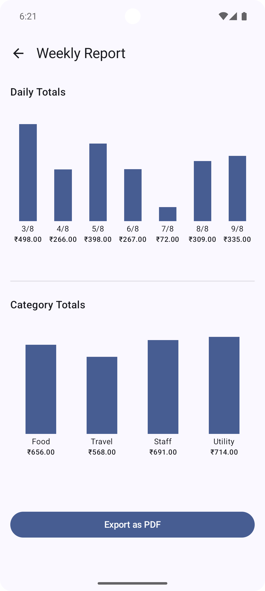
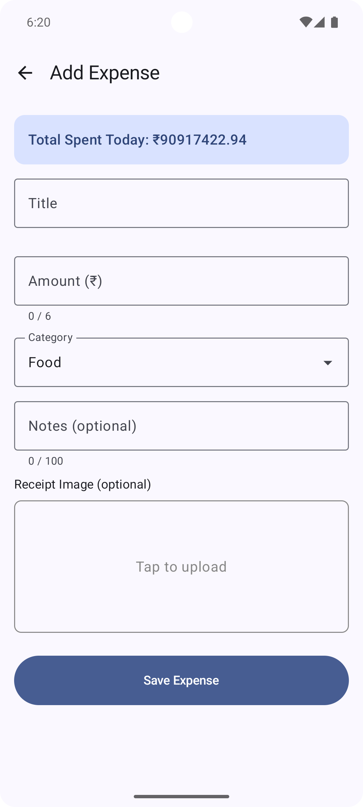

# SmartKharch

## 📌 App Overview
SmartKharch is an expense tracking and reporting app built with **Jetpack Compose**, **MVVM architecture**, and **Hilt** for dependency injection.  
It provides users with visual insights into daily and category-wise spending using **bar charts** and **category summaries**.

---

## 🤖 AI Usage Summary
During the development of SmartKharch, AI tool **ChatGPT** were used to:
- Generate Jetpack Compose UI components like `SimpleBarChart` and custom-styled dialogs.
- Debug layout alignment issues (e.g., bars growing from bottom to top).
- Optimize `ViewModel` data flow using `StateFlow` and mock data generation.

---

## 📝 Prompt Logs (Key Examples)
- I want to build an Android expense tracking app from scratch using Jetpack Compose, MVVM, and Hilt. Can you give me a feature list and folder structure?
- Suggest ways to make my expense report UI look modern and professional in Jetpack Compose.
- I need to handle loading, success, and error states in my expense report screen. Can you show me how to model UI state using sealed classes with StateFlow?
- Help me set up Hilt in my app. I want to inject my ExpenseRepository into the ExpenseReportViewModel using constructor injection.
- Now that the app is mostly done, can you create a README.md with an overview, how I used AI tools like ChatGPT, prompt logs, features implemented, screenshots, and an APK link?

---

## ✅ Features Implemented
- 📊 Bar chart visualization for last 7 days expenses (MOCK).
- 📂 Category-wise expense breakdown (Food, Travel, Staff, Utility).
- 📅 Date picker with min/max date constraints.
- 🗄 MVVM architecture with Hilt dependency injection.
- 🔄 Reactive UI updates with `StateFlow`.
- 🧪 Mock data generation for development/testing.

---

## 📥 APK Download
[Download APK](https://your-apk-link-here.com)  
*(Replace with actual link to GitHub Releases, Google Drive, or other hosting.)*

---

## 📸 Screenshots
| Expense Report                                   | Add Expense                              | Expense List                            |
|--------------------------------------------------|------------------------------------------|-----------------------------------------|
    |  |  |  |

---
