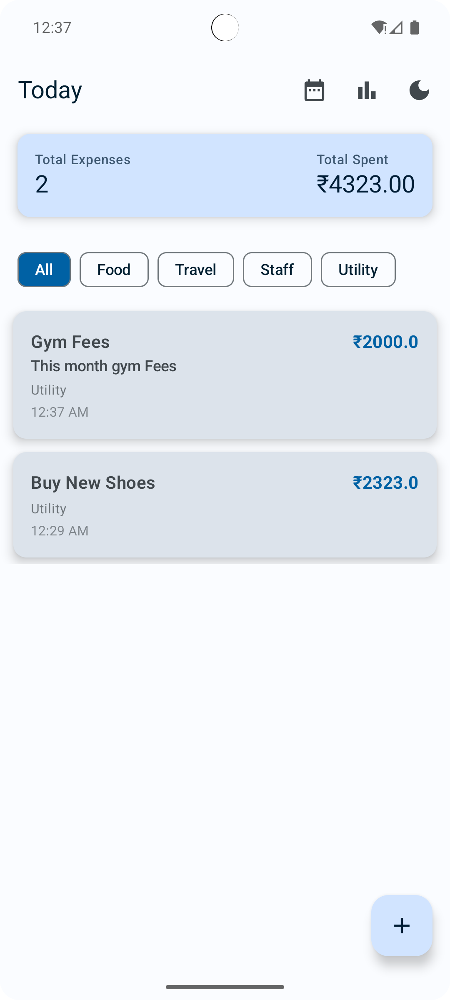
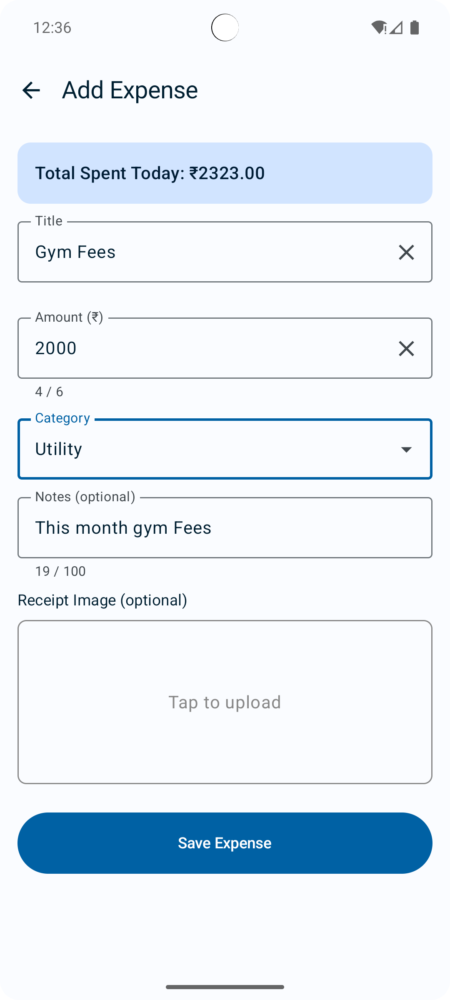
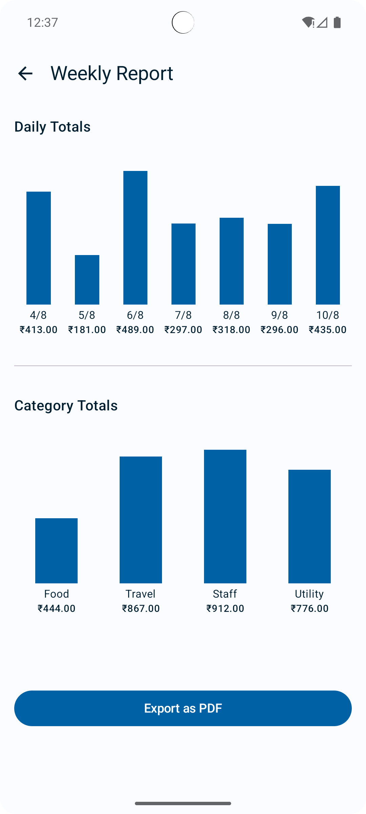

# SmartKharch

## 📌 App Overview
Track, visualize, and control your daily expenses with ease — anywhere, anytime.

---

## 📸 Screenshots
<p align="center">
  
  
  
</p>

---

## 🛠 Tech Stack
- **Language:** Kotlin
- **UI:** Jetpack Compose
- **Architecture:** MVVM
- **DI:** Hilt
- **Database:** Room

---

## 🤖 AI Usage Summary
During the development of SmartKharch, AI tool **ChatGPT** were used to:
- Generate Jetpack Compose UI components like `SimpleBarChart` and custom-styled dialogs.
- Debug layout alignment issues (e.g., bars growing from bottom to top).
- Optimize `ViewModel` data flow using `StateFlow` and mock data generation.

---

## 📝 Prompt Logs (Key Examples)
- I want to build an Android expense tracking app from scratch using Jetpack Compose, MVVM, and Hilt. Can you give me a feature list and folder structure?
- Suggest ways to make my expense report UI look modern and professional in Jetpack Compose.
- I need to handle loading, success, and error states in my expense report screen. Can you show me how to model UI state using sealed classes with StateFlow?
- Help me set up Hilt in my app. I want to inject my ExpenseRepository into the ExpenseReportViewModel using constructor injection.
- Now that the app is mostly done, can you create a README.md with an overview, how I used AI tools like ChatGPT, prompt logs, features implemented, screenshots, and an APK link?

---

## ✅ Features Implemented
- 📊 Bar chart visualization for last 7 days expenses (MOCK).
- 🌓 Light/Dark Theme support.
- 💾 Room DB for local data persistence.
- ✅ Validation on Expense Entry.
- ♻️ Reusable UI components.
- 📂 Category-wise expense breakdown (Food, Travel, Staff, Utility).
- 📅 Date picker with min/max date constraints.
- 🗄 MVVM architecture with Hilt dependency injection.
- 🔄 Reactive UI updates with `StateFlow`.
- 🧪 Mock data generation for development/testing.

---

## ⚙️ Installation
1. Clone the repository
   ```bash
   git clone https://github.com/akashofficialdev/smart-kharch.git
2. Open in Android Studio.
3. Sync Gradle & run the app.

## 📥 APK Download
[Download APK](https://www.dropbox.com/scl/fi/zjo6je0scubbpno8r7x2c/SmartKharch.apk?rlkey=lxh6o0nvkeurds01jgbh0wlzm&st=vr7tcqjd&dl=0)

---

## 🔗 Repository Link
[](https://github.com/akashofficialdev/smart-kharch)


